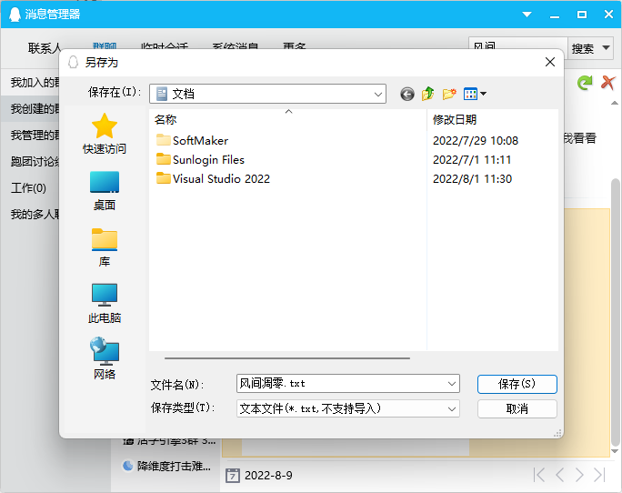
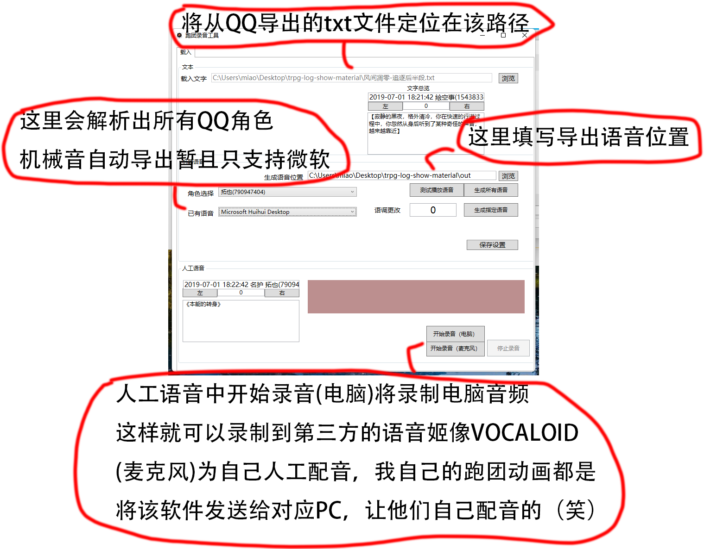

# 爱抚天的跑团录音工具（席德梅尔的文明（X））
QQ答疑群：398193304
爱抚天的跑团录音工具是附属于TRPGLogline的文字音频转换工具。
用这个软件进行声音的配音/录制来保证可以被TRPGLogline正常读取。
软件支持QQ格式和通用格式，通用格式参考软件下载的附录文本或以下格式

角色A(1)   
对话  

角色B(2)   
对话2   

角色C(3)   
对话3

角色D(4)   
对话4   

使用该软件导出的音频禁止商业用途，仅可作为非商业配音使用。   
__教程看不到图可以拉取到本地阅读或开启梯子。__

# 目录
- [爱抚天的跑团录音工具（席德梅尔的文明（X））](#爱抚天的跑团录音工具席德梅尔的文明x)
- [目录](#目录)
- [导出QQ记录](#导出qq记录)
- [软件生成配置](#软件生成配置)
- [MoeGoe使用部分](#moegoe使用部分)
# 导出QQ记录
点击所在日志的QQ记录，点击选择想要导出的群组   
保存类型设置为txt文件,您可以自由删除不必要的对话，这样就完成了文件准备工作。
# 软件生成配置

# MoeGoe使用部分
该部分只是基于MoeGoe-GUI的扩写,emotional-vits将在不久后添加
用于适配《爱抚天的语音生成工具规则》
https://github.com/CjangCjengh/MoeGoe_GUI

配置与MoeGoe_GUI一致，配置完成后即可生成基于VITS模型的语音   
其中模式选择为   
中文：拥有中文模型的语音生成中文   
日文：拥有日语模型的语音生成日文   
混合：默认生成中文[]语句框起来的生成日文   
手动：语法与MoeGue一致，需要添加[JA][CH]   

时长：MoeGoe的语速控制   
浮动：多次生成时，每次时长进行的小幅度随机来达到更丰富音色的效果。

当在[生成次数]中指定生成大于一次的语音时，会自动生成文件夹，文件夹内为当批次语音。

朗读调整：默认显示和左下角的预览语音一致，但实际朗读时刻更改此文本来达到实际阅读的效果。

批量修改命名音频：将多次生成的vits语音文件夹内的语音复制到外面时，将会重命名去掉尾号，与其他音频格式保持一致。

音频录制格式为  WaveFormat(44100,16,1);
